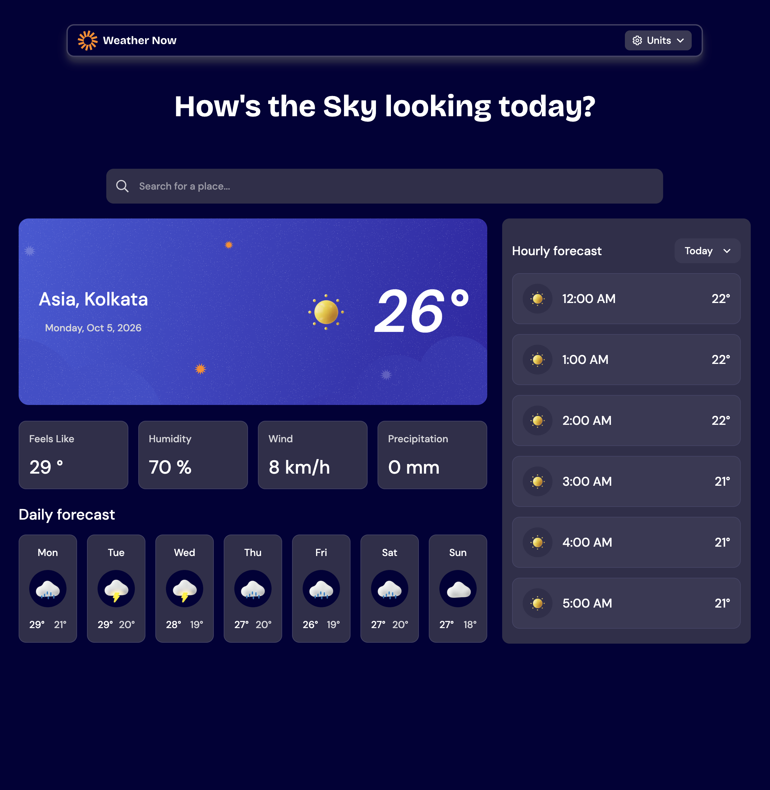
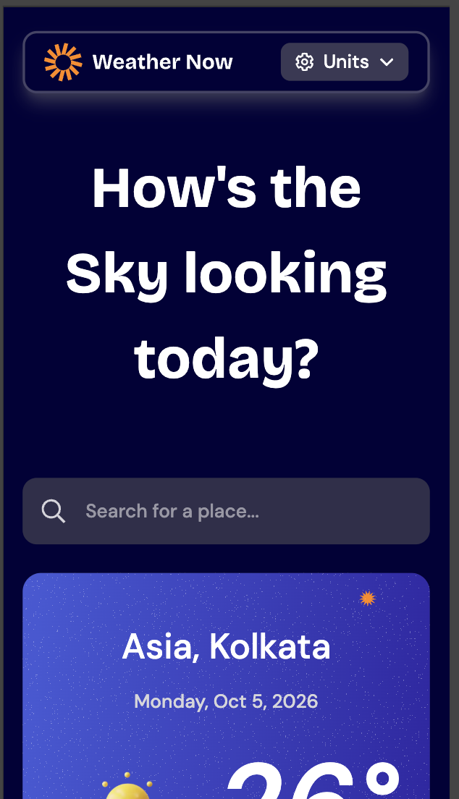

# Frontend Mentor - Weather app solution

This is a solution to the [Weather app challenge on Frontend Mentor](https://www.frontendmentor.io/challenges/weather-app-K1FhddVm49). Frontend Mentor challenges help you improve your coding skills by building realistic projects.

## Table of contents

- [Overview](#overview)
  - [The challenge](#the-challenge)
  - [Screenshot](#screenshot)
  - [Links](#links)
- [My process](#my-process)
  - [Built with](#built-with)
  - [What I learned](#what-i-learned)
- [Author](#author)

## Overview

### The challenge

Users should be able to:

- Search for weather information by entering a location in the search bar
- View current weather conditions including temperature, weather icon, and location details
- See additional weather metrics like "feels like" temperature, humidity percentage, wind speed, and precipitation amounts
- Browse a 7-day weather forecast with daily high/low temperatures and weather icons
- View an hourly forecast showing temperature changes throughout the day
- Switch between different days of the week using the day selector in the hourly forecast section
- Toggle between Imperial and Metric measurement units via the units dropdown
- Switch between specific temperature units (Celsius and Fahrenheit) and measurement units for wind speed (km/h and mph) and precipitation (millimeters) via the units dropdown
- View the optimal layout for the interface depending on their device's screen size
- See hover and focus states for all interactive elements on the page

### Screenshot

### Links

- Solution URL: [GitHub](https://github.com/piyush-kaushik24/weather-app)
- Live Site URL: [Weather app](https://weather-app-delta-black-82.vercel.app/)

## My process

### Built with

- Semantic HTML5 markup
- CSS custom properties
- Flexbox
- CSS Grid
- Mobile-first workflow
- [TypeScript](https://www.typescriptlang.org/)
- [React](https://react.dev/) - JS library
- [Tailwind CSS](https://tailwindcss.com/) - CSS framework

### What I learned

- Learned how to fetch and manage asynchronous data using custom hooks, including loading and error states.
- Learned how to use debouncing to delay API requests while the user is typing in the location search field.
- Learned how to work with nested API response data and create TypeScript interfaces for complex weather structures.
- Improved my understanding of nullable data and handling cases where requested data may not exist before rendering it.
- Learned how to keep source-of-truth state separate from derived data instead of storing unnecessary duplicated state.
- Learned how to handle different measurement systems and convert values such as Celsius/Fahrenheit, km/h/mph, and mm/inches.
- Learned how weather codes from an API can be mapped to appropriate weather icons and UI representations.
- Improved my understanding of React controlled components, state updates, effect dependencies, and custom hooks.
- Improved accessibility by using semantic HTML, labels, buttons, accessible names, and appropriate handling of decorative images and icons.
- Learned that TypeScript types describe what code expects, but external API responses are still runtime data and cannot automatically be trusted to match those types.

## Author

- GitHub - [@piyush-kaushik24](https://github.com/piyush-kaushik24)
- Frontend Mentor - [@piyush-kaushik24](https://www.frontendmentor.io/profile/piyush-kaushik24)
